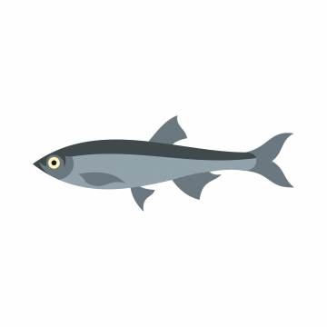

```{r setup, include=FALSE}
options(warn=-1)
knitr::opts_chunk$set(echo = TRUE)
library(dplyr)
library(corrplot)
library(jsonlite)
library(purrr)
library(caret)
library(ggplot2)
```


## R Markdown
``` {r}
### Set seed to make experiment reproducible
set.seed(123)
n <- 1000
```

## Set working dir to script level
current_working_dir <- dirname(rstudioapi::getActiveDocumentContext()$path)
setwd(current_working_dir)


## Load dataset
``` {r}
sledz_data <- read.csv("res/sledzie.csv", stringsAsFactors = FALSE)
```

### Print the Dimension of dataset
``` {r}
dim(sledz_data)
```

# Exclude the missing observations
``` {r}
idx <- sledz_data == "?"
is.na(sledz_data) <- idx
sledz_data <-sledz_data %>%
na.omit()		
dim(sledz_data) 
```

### Head of 5 first rows (to illustrate how does it looks like)
``` {r}
head(select(sledz_data, 1:ncol(sledz_data)))
```

## Data sampling
``` {r include=FALSE}
sledz_sample <- sample(1:nrow(sledz_data), n)
sledz_sample
sort(sledz_sample)
sledz_origin <- sledz_data
sledz_data <- sledz_data[sledz_sample, ]
sledz_data

sizes <- toJSON(sledz_data[,2],dataframe="rows")
```

## Data info

### Mean
``` {r}
s_mean <- summarise_each(sledz_data, funs(mean))
s_mean
```

### Std
``` {r}
s_std <- summarise_each(sledz_data, funs(sd))
s_std
```

### Min
``` {r}
s_min <- summarise_each(sledz_data, funs(min))
s_min
```

### Max
``` {r}
s_max <- summarise_each(sledz_data, funs(max))
s_max
```

## Correration
```{r}
sledz_num = sapply( sledz_data, as.numeric )
cor_mat <- sledz_num[, 1:ncol(sledz_num)]
cor_mat = cor(cor_mat)

corrplot(cor_mat, method="circle")
```

## Interactive picture

<input type="range" min="1" max=`r n` value=cur class="slider" id="myRange">

<input id="current_idx" type="text" value="">

<script>
var slider = document.getElementById("myRange");
sizes = (`r sizes`)

slider.oninput = function() {
  cur = slider.value; 
  var s = document.getElementById('current_idx');
  
  step = sizes.length/1000
  size = sizes.slice(step * cur, step * cur+1)
  size = size.reduce((a,b) => a + b, 0)
  size = size/step
  
  s.value = 'pozycja: ' + cur + '\t rozmiar: ' + size;
  
  var ryba = document.getElementById('ryba');
  ryba.width = size*10
}
</script>

# Regression

``` {r}
sledz_num = sapply(sledz_origin, as.numeric )
#sledz_num  <- as.data.frame(t(sledz_num ))

smp_size <- floor(0.75 * nrow(sledz_num))

train_ind <- sample(seq_len(nrow(sledz_num)), size = smp_size)

ctrl <- trainControl(
  method = "repeatedcv",
  number = 2,
  repeats = 5
)

train_data <- sledz_num[train_ind, ]
test_data <- sledz_num[-train_ind, ]

model <- train(length ~ .,
               data = train_data,
               method = "gbm",
               trControl = ctrl,
               verbose= FALSE
)

model

 #test_data["length"]
 
 #test_data  <- as.data.frame(t(test_data))
 
predictions <- predict(model, test_data)

```

# Model summary
``` {r}
summary(model$finalModel)
```


